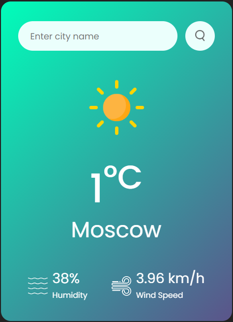

# 🌦️ WeatherWave - Real-Time Weather Application

A sleek, responsive weather application that provides real-time weather data for any city worldwide. Built with HTML, CSS, and JavaScript using the OpenWeatherMap API.

🔗 Live Demo: https://weatherwave-vjs.netlify.app/




## 🌟 Features

- 🔍 Search weather by city name
- 🌡️ Real-time temperature display (Celsius)
- 💧 Humidity and wind speed monitoring
- 🌤️ Dynamic weather condition icons
- 📱 Mobile-responsive design
- 🚨 Error handling for invalid inputs
- ⚡ Instant search with Enter key support

## 🛠️ Installation

1. Clone the repository:
```bash
https://github.com/OthmanYahya/Weather-App.git
```

🚀 Usage
    Open index.html in browser
    Enter city name in search field
    Click search button or press Enter
    View current weather data
    For invalid cities: "City not found" error displays

🌐 API Reference
    OpenWeatherMap Current Weather Data API
    Endpoint: api.openweathermap.org/data/2.5/weather
    Required Parameters: q={city name}&units=metric&appid={API_KEY}

🧰 Technologies
    Frontend: HTML5, CSS3, JavaScript (ES6)
    Styling: CSS Flexbox/Grid, Google Fonts
    API: OpenWeatherMap (Free Tier)
    Build: Vanilla JS (No dependencies)

🎨 Design Principles
    Mobile-first responsive approach
    Gradient background with glassmorphism effects
    Smooth animations and transitions
    Color scheme aligned with weather conditions
    Clear typography hierarchy

🤝 Contributing
1. Fork the repository
2. Create feature branch:
```bash
    git checkout -b feature/amazing-feature
```
3. Commit changes:
```bash
    git commit -m 'Add amazing feature'
```
4. Push to branch:
```bash
    git push origin feature/amazing-feature
```
5. Open Pull Request
